# QuiahGroup - User Role Flows

## All User Roles Overview

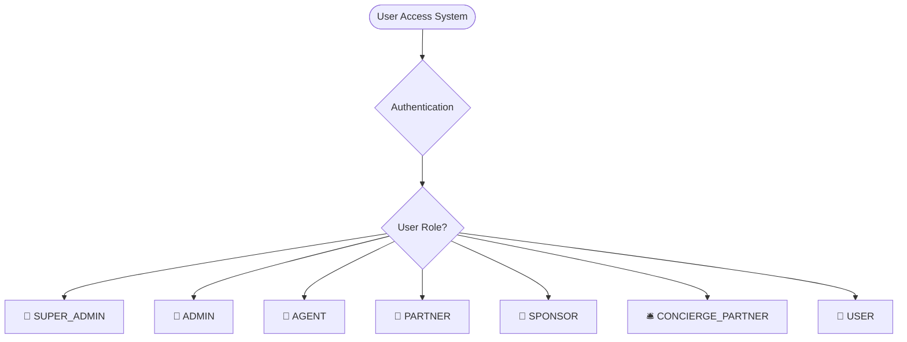

---

## 1. Super Admin Flow

```mermaid
flowchart TD
    SA([👑 SUPER_ADMIN]) --> SA_FULL[Full System Access]
    
    SA_FULL --> SA_USERS[Manage Users]
    SA_FULL --> SA_PROPS[Manage All Properties]
    SA_FULL --> SA_PARTNERS[Manage Partners]
    SA_FULL --> SA_CONCIERGE[Manage Concierge]
    SA_FULL --> SA_SPONSORS[Manage Sponsors]
    SA_FULL --> SA_EVENTS[Manage Events]
    SA_FULL --> SA_ANALYTICS[View All Analytics]
    SA_FULL --> SA_SETTINGS[System Settings]
    
    SA_USERS --> SA_U1[Create/Edit/Delete Users]
    SA_USERS --> SA_U2[Change User Roles]
    SA_USERS --> SA_U3[View All User Activity]
    
    SA_PROPS --> SA_P1[Approve/Reject Properties]
    SA_PROPS --> SA_P2[Verify Properties]
    SA_PROPS --> SA_P3[Manage Listings]
    
    SA_PARTNERS --> SA_PA1[Approve Partner Applications]
    SA_PARTNERS --> SA_PA2[Manage Partner Campaigns]
    SA_PARTNERS --> SA_PA3[Partner Performance Reports]
    
    SA_CONCIERGE --> SA_C1[Assign Tickets]
    SA_CONCIERGE --> SA_C2[Approve Partners]
    SA_CONCIERGE --> SA_C3[View All Tickets]
    
    SA_SPONSORS --> SA_S1[Approve Sponsor Applications]
    SA_SPONSORS --> SA_S2[Manage Event Sponsorships]
    SA_SPONSORS --> SA_S3[Review Campaigns]
```

---

## 2. Admin Flow

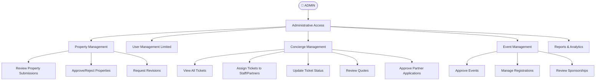

---

## 3. Agent Flow

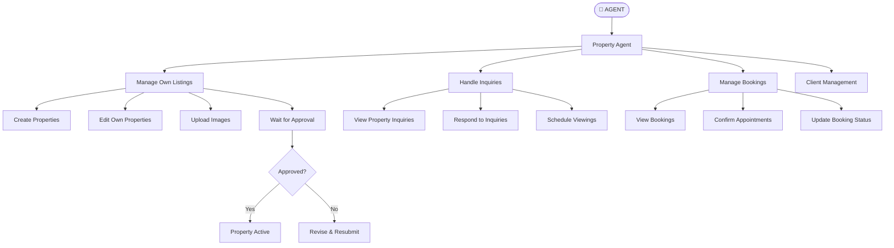

---

## 4. Partner Flow

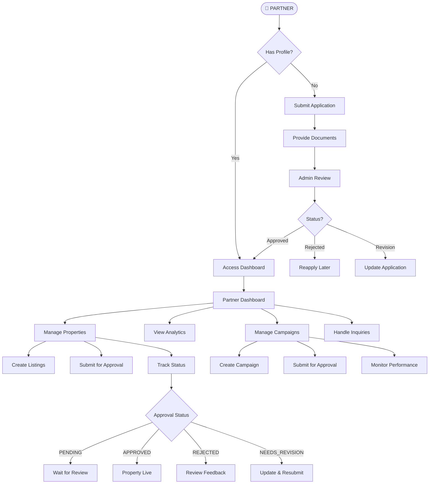

---

## 5. Sponsor Flow

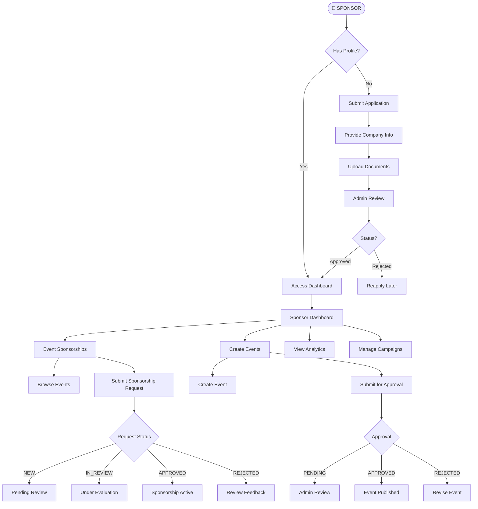

---

## 6. Concierge Partner Flow

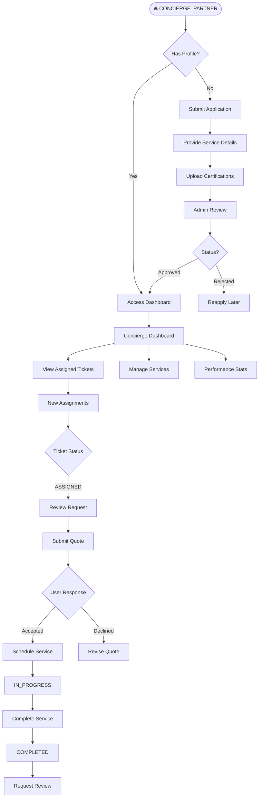

---

## 7. Regular User Flow

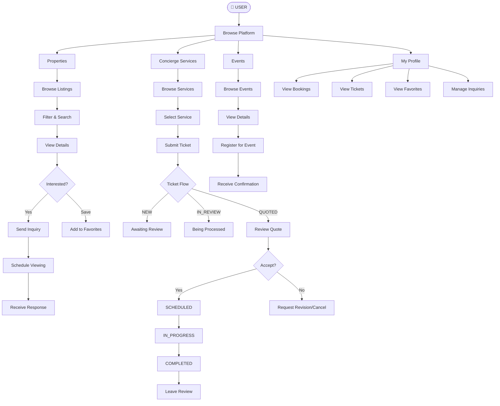

---

## Property Approval Flow (All Roles)

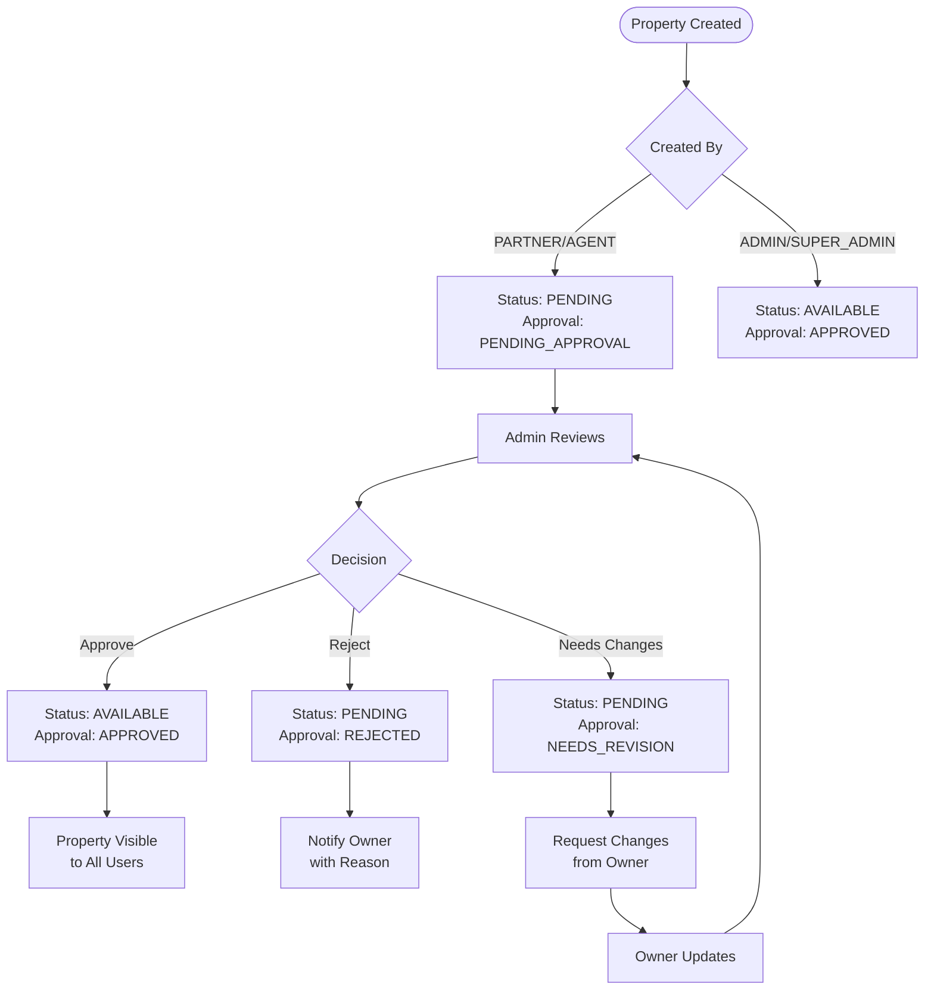

---

## Concierge Ticket Flow (Complete)

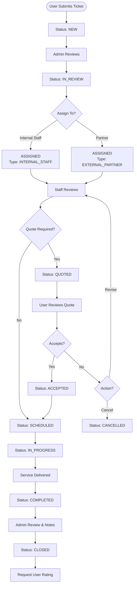

---

## Authentication & Access Control

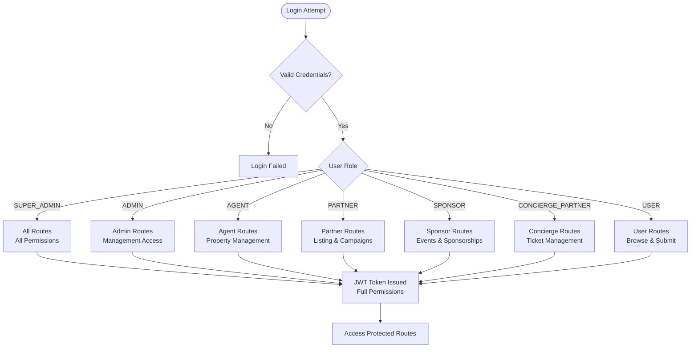

---

## Test Accounts Reference

| Role | Email | Password |
|------|-------|----------|
| 👑 Super Admin | admin@quiahgroup.com | admin123 |
| 👤 Regular User | user@quiahgroup.com | user123 |
| 🏢 Agent | agent@quiahgroup.com | agent123 |
| 🤝 Partner | partner@quiahgroup.com | partner123 |
| 💎 Sponsor | sponsor@quiahgroup.com | sponsor123 |
| 🛎️ Concierge Partner | concierge@quiahgroup.com | concierge123 |

---

## API Endpoints by Role

### Super Admin Only
- `POST /api/users` - Create users
- `DELETE /api/users/:id` - Delete users
- `PUT /api/users/:id/role` - Change user roles
- `GET /api/admin/system-settings` - System configuration

### Admin + Super Admin
- `GET /api/admin/properties` - All properties
- `POST /api/admin/properties/:id/approve` - Approve property
- `POST /api/admin/properties/:id/reject` - Reject property
- `GET /api/concierge/tickets` - All concierge tickets
- `PUT /api/concierge/tickets/:id/assign` - Assign tickets
- `POST /api/admin/partners/:id/approve` - Approve partners

### Agent
- `POST /api/properties` - Create property
- `PUT /api/properties/:id` - Update own property
- `GET /api/properties/my-properties` - Own properties
- `GET /api/inquiries` - Property inquiries

### Partner
- `POST /api/properties` - Create property (requires approval)
- `GET /api/partner/dashboard` - Partner dashboard
- `POST /api/partner/campaigns` - Create campaign
- `GET /api/partner/analytics` - Performance stats

### Sponsor
- `POST /api/sponsors/apply` - Submit application
- `POST /api/events` - Create event (requires approval)
- `POST /api/event-sponsorships` - Submit sponsorship request
- `GET /api/sponsors/dashboard` - Sponsor dashboard

### Concierge Partner
- `GET /api/concierge/tickets/assigned-to-me` - Assigned tickets
- `POST /api/concierge/tickets/:id/quote` - Submit quote
- `PUT /api/concierge/tickets/:id/complete` - Complete ticket
- `POST /api/concierge/tickets/:id/notes` - Add notes

### Regular User
- `GET /api/properties` - Browse properties
- `POST /api/properties/:id/inquiry` - Submit inquiry
- `POST /api/concierge/tickets` - Request service
- `GET /api/concierge/tickets/my-tickets` - Own tickets
- `POST /api/events/:id/register` - Register for event
